# **CaveBoy**: Reconocimiento de vídeo paralelizado mediante redes neuronales

Alberto Montes y Javier Santacruz

\tableofcontents

## 1. **Introducción**

A la hora de elegir un algoritmo o sistema susceptible de paralelización, los candidatos realmente
interesantes son aquellos capaces de resolver un problema hasta el momento necesariamente
realizado por humanos. La automatización de tareas repetitivas, eliminando trabajos
pesados, rutinarios y poco creativos, es uno de los mayores alicientes para un programador.

Pensando de esta manera, llegamos a una tarea maquinal actualmente realizada por personas: los
apuntadores de televisión. Trabajadores que ven la televisión durante horas, comprobando la entrada
de bloques publicitarios o programas, calculando el tiempo total de aparición. Realizan una tarea
pesada, muchas veces no en las mejores condiciones y a costa de su salud. Tanto las productoras de
televisión como las grandes marcas que invierten en publicidad contratan grupos para controlar su
programación o cerciorarse de que los bloques publicitarios contratados salen en el período
acordado y el tiempo suficiente.

Decidimos llamar al proyecto `CaveBoy` en pequeño homenaje al apodo (*Los chicos de la cueva*) con
que se referían al equipo que se dedicaba a visualizar vídeos de continuo en un conocido programa
de televisión de la cadena *La Sexta*.

### **Problema**

La finalidad del programa desarrollado será la de reconocer y clasificar secuencias concretas de
vídeo insertadas dentro de una secuencia más larga. Esto es, detectar la presencia de publicidad
comercial dentro de una emisión de vídeo razonablemente grande. 

Estas pequeñas secuencias a reconocer serán los *anuncios*, insertados en un *programa* completo
mucho más largo, y que de otra manera, sería necesario visualizar en su totalidad a fin de
localizar las partes buscadas.

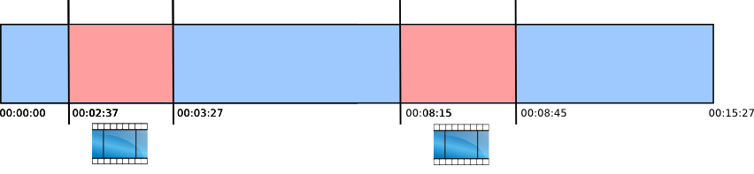

El programa debería reconocer cada *anuncio* como uno de los situados en la base de datos o base de
conocimiento del programa, detectar el inicio y su término y cuanto tiempo ha sido emitido. Todo
esto a realizar de forma exacta, con una granularidad y precisión dentro del umbral del segundo. De
esta manera es posible suplir el trabajo humano de ver horas y horas de vídeo esperando a ver una
secuencia o dos de vídeo dentro de un programa completo y apuntar la hora a la que empieza y
termina, incrementando la precisión de las mediciones.

### **Notación**

En este documento notaremos en letra monoespaciada los nombres de `ficheros`, `funciones` y
`variables`. En cursiva irán los nombres propios como *CUDA*, *Nvidia* u *OpenMP*. 
Los fragmentos de código serán indentados varios espacios y reproducidos en letra monoespaciada:

	CC=gcc
	# Debug flags
	CFLAGS := -g -pg -enable-checking -ggdb -Wall -O0\
	          -pedantic -std=c99 -DDEBUG -Iperceptron 

Los puntos remarcables y los problemas serán **destacados** en negrita.

### **Términos**

A lo largo del documento nos referiremos al vídeo completo como **secuencia**, a los fragmentos a
reconocer o anuncios como **conjunto de patrones**, siendo un **patrón** un único fotograma aislado
del vídeo.

## 2. **Planteamiento**

En esta sección describiremos el planteamiento del problema en términos más formales, describiendo
la aproximación elegida a la edición de vídeo, el funcionamiento y arquitectura de la red neuronal
elegida y el funcionamiento general de la aplicación, la cual se encuentra dividida en 2:
Entrenamiento y Explotación.

### 2.1 **Acercamiento al problema**

Los vídeos están formados por un conjunto de imágenes reproducidos a una frecuencia conocida y con
un audio asociado. Dejando de lado ese audio, el cual no resulta interesante para nuestros
propósitos, podemos sencillamente reducir el vídeo a un conjunto de imágenes estáticas, de
*fotogramas*. Una vez entendido el mismo como un conjunto de fotos, el problema del reconocimiento
es trasladado de un problema de análisis de vídeo a uno de imagen, mucho más sencillo.

Esta división en fotogramas es muy conveniente a la hora de procesar el vídeo, donde podemos
dividirlo eventualmente en secciones para su proceso de forma paralela y para encajar dentro de la
rígida entrada de una red neuronal. Por este motivo decidimos que el modo de operación del sistema
sería dividir un flujo de vídeo entrante en bloques de aproximadamente un minuto de longitud, y
dentro del bloque, la unidad mínima de proceso sería el *fotograma*, pudiendo de esta manera evitar
el desafío técnico del análisis de vídeo en streaming, en tiempo real, y permitiendo así una
granularidad los suficientemente pequeña como para disponer de gran flexibilidad a la hora de
dividir el problema.

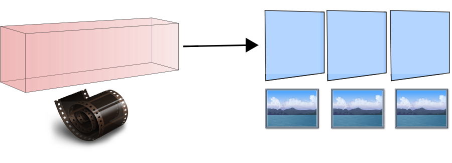

### 2.2 **Posibles enfoques**

Reducido pues el problema a la identificación de imágenes puntuales contra una base de conocimiento
previamente almacenada, se presentaban diferentes opciones para el reconocimiento de las mismas:

- **Diferencia media**: Una comparación pixel a pixel de cada fotograma contra todos los fotogramas
  almacenados como *patrones* es la solución obvia, y sin embargo pesada, poco flexible y poco
  eficiente. Para tamaños de video grandes o ante variaciones significativas del vídeo original
  debido a modificaciones en su emisión, esta medida se revela poco acertada y eficiente.

- **Hashing**: Consideramos posible el desarrollo de una nueva función de hashing o función
  resumen, que tomase como entrada un fotograma y calculase un número (necesariamente muy grande)
  en base al valor de cada pixel y su posición en la imagen. Pequeñas variaciones en la imagen
  darían como resultado números muy parecidos, de forma que, mediante un *radio* o una función de
  *cercanía* pudiesen relacionarse *hashes* de imágenes entre si. Sin embargo el desarrollo de tal
  función no es una tarea del todo sencilla, al menos, de forma que mantenga las propiedades de
  inyectividad de las funciones resumen y varíe linealmente ante los cambios producidos en su
  entrada, en las imágenes, de forma que se mantenga la comparabilidad entre resúmenes de
  fotogramas.

- **Red Neuronal**: Una red neuronal es capaz de *aprender* un conjunto de valores y de reconocer
  otros *parecidos* una vez que ha sido entrenada correctamente. Los defectos de las redes
  neuronales son su limitada capacidad de almacenamiento, dificultad para reconocer muchos
  patrones, la necesidad de un entrenamiento previo y el contar con una entrada de tamaño fijo.

Todas estas diferentes opciones planteaban distintas posibilidades de futura paralelización, una
flexibilidad diferente y también un interés y atractivo distinto.

### 2.3 **Planteamiento elegido**

El operador de reconocimiento finalmente empleado fue una Red Neuronal multicapa, siguiendo la
arquitectura de un *Perceptrón* y siendo entrenada mediante el algoritmo de *Retropropagación* o
*Backpropagation*.

Las razones de esta elección radican en la naturaleza invariante del tamaño del problema, ya que
todos los fotogramas analizados son de tamaño similar, y la necesidad de un reconocimiento general,
flexible ante pequeñas modificaciones posibles en la emisión de publicidad, como marcos añadidos,
presentadores en primer plano sobre la publicidad o su coexistencia en pantalla con retransmisiones
deportivas.

La Red Neuronal elegida tomará cada fotograma y dictaminará a que anuncio pertenece.

### 2.4 **Red Neuronal**

Una red neuronal de tipo *Perceptrón multicapa*, se encuentra formada una serie de *neuronas*, que
mantienen un estado (en la implementación un valor numérico entre -1 y 1) y que están a su vez
conectadas entre sí, ordenadas en capas. Estas conexiones son lo determinante en una red, cada
conexión cuenta con un peso (otro valor numérico) que define la interacción entre esas *neuronas*. 
Estos pesos son establecidos durante el entrenamiento de la red y determinan el funcionamiento de
la misma.

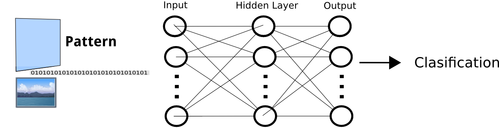

La red se encuentra organizada en *capas* de neuronas. Cada capa se encuentra fuertemente conectada
a las neuronas de la capa siguiente mediante *pesos*. Existe una capa de entrada y una capa de
salida. Los datos de trabajo (*patrón*) son depositados en la capa de entrada, evoluciona a través de
la red y los pesos capa tras capa y es recogido en la capa de salida, que marca la clasificación final de los
datos de entrada.

La unidad de trabajo de la red es el *patrón*. Un patrón es un conjunto de valores que se ajusta al
tamaño de la capa de entrada. En nuestro caso, con un *patrón* nos referiremos a 

El empleo de las redes neuronales se divide en dos etapas claramente diferenciadas: *Entrenamiento*
y *Explotación*. Durante el entrenamiento, la red asocia datos de entrada con su correspondiente
salida, a lo largo de un proceso costoso y complejo. Una vez entrenada, la red es capaz de
clasificar conjuntos de valores de forma general según su parecido con los patrones memorizados
durante el entrenamiento, y de forma muy rápida.

De esta manera, podemos entrenar la red con un procedimiento lento y penoso, y usarla en producción
forma repetida muy rápidamente y de forma eficiente para reconocer unas cuantas secuencias, que es
lo que se busca.

### 2.5 **Red Neuronal: Entrenamiento** 

Durante el entrenamiento la red tratará de interiorizar o memorizar los patrones de ejemplo
(*patrones de entrenamiento*) que debe recordar más tarde durante la explotación y que le servirán
para clasificar los fotogramas. 

Este entrenamiento consiste en presentar a la red neuronal en su capa de entrada un *patrón* de
ejemplo del cual conocemos su clasificación, y en la capa de salida, su valor de resultado ya
conocido. Con estos datos, aplicando el algoritmo de *Retropropagación*, se computa el valor de la
salida de la red con esos datos, se compara con el valor deseado y se corrigen los pesos presentes
en la red capa por capa, calculando el gradiente y modificando los pesos de forma que la salida de
la red se aproxime cada vez más al resultado deseado.

Este método debe realizarse de forma iterada presentado todos y cada uno de los patrones a
memorizar una serie de veces hasta que los pesos de la red proporcionen una salida adecuada,
relacionando de forma correcta las entradas y salidas.

Una vez entrenada la red de forma adecuada, los pesos son guardados, ya que compondrán la
arquitectura de la red a la hora de emplearla durante la explotación.

### 2.6 **Red Neuronal: Explotación**

Tras el entrenamiento, y disponiendo del conjunto de pesos que conforman la arquitectura del
*Perceptrón*, únicamente es necesario crear la red con estos valores y comenzar a presentar en la
capa de entrada los patrones a analizar para obtener una salida.

La red aproxima y clasifica la salida o bien como una de las secuencias memorizadas, o como
ninguna. Esto se hace mediante la activación en la salida del código o valor asociado con una de
las secuencias memorizadas, o mediante la presencia de un código completamente desconocido, lo cual
indicaría que ante la presencia de una secuencia extraña, la red produce una salida en un estado
espúreo.

Esta explotación es varias veces más rápida que el entrenamiento, ya que solo hay que computar una
única vez cada *patrón* a través de la red neuronal para obtener el resultado. 

## 3. **Implementación**

Comprendida la naturaleza del problema y la aproximación elegida para resolverla, es necesario
introducir los detalles de su implementación, la disposición y formato esperado de la entrada, la
salida del algoritmo, las estructuras y algoritmos empleados y las limitaciones inherentes a la
arquitectura y tecnología empleadas.

#### 3.1 **El formato *png* **

La elección del formato de imagen de los fotogramas era una decisión delicada. El formato adecuado
debía cumplir ciertos requisitos bastante estrictos. En concreto debía:

- **Tener compresión**: Una de las tareas a realizar durante la paralelización será la transmisión
  de datos mediante la red a otros nodos de un cluster o a otros dispositivos como tarjetas
  gráficas, la compresión es muy deseable ya que el tratamiento de vídeos implica grandes volúmenes
  de datos, y su transmisión constituye indudablemente un cuello de botella claro. Formatos
  sencillos de tratar como `BMP` fueron descartados aquí.
- **No tener pérdida**: Un formato con compresión pero con pérdida como el `JPEG` distorsionaría la imagen original,
  inutilizando la *imagen*/*patrón* para nuestros propósitos.
- **Ser fácil de manejar**: Debe ser un formato conocido y ampliamente implementado, de manera que
  no introduzca grandes dependencias en el proyecto o resulte farragoso de emplear, complicando el
  código innecesariamente. En este punto cayó el formato `TIFF`, ya que no pudimos encontrar una
  librería sencilla en lenguaje `C` que manejase este formato de forma eficiente.

El formato elegido fué finalmente `PNG`, que reune todas las condiciones anteriores. Es un formato
que admite compresión, pero es compresión de tipo `GZIP`, sin pérdida. Al ser un formato licenciado
bajo una licencia software libre, estandarizado \footnote{Estándar por el Internet Engineering
Steering Group, ISO/IEC 15948:2004}, ampliamente utilizado en el contexto web, existían múltiples
implementaciones livianes y libres para su manejo, especialmente orientadas a móviles y de muy
reducido tamaño que fueron de gran utilidad. 

Se encontraron dos bibliotecas candidatas para el manejo de las imágenes `PNG`: *pnglite* y
*LodePNG*. Se eligió *pnglite* al presentar una interfaz más sencilla y limpia, permitir abrir una
imagen sin traer sus contenidos a memoria y poder acceder a los datos comprimidos de una imagen `en
crudo` de forma directa, como un vector de `unsigned char`, lo cual se demostró útil a lo largo de la programación del proyecto.

Cuando una imagen `png` es cargada en memoria y descomprimida, esta se encuentra en *crudo*, es
decir solo bytes, sin distinción alguna de filas, columnas o píxeles. Sin embargo, para evitar
introducir cada byte por separado en la red neuronal, lo cual nos haría necesitar de una red
neuronal entre 3 y 4 veces más grande que el tamaño en pixeles de la imagen, estos bytes son
agrupados bit a bit en un solo valor, operando así con un vector de valores más pequeño donde cada
valor corresponde a los tres colores de único pixel.

### 3.2 **Formato de patrones**

Tomamos un *patrón* como un único frame perteneciente a una secuencia de un vídeo. En otras
palabras, analizamos los vídeos dividiéndolos (*slicing*) en múltiples imágenes individuales que
son analizadas por separado.

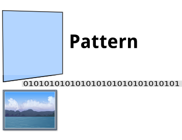

La separación de los bloques de vídeo en imágenes individuales se denomina *preparación* y es
realizada de forma externa al programa mediante un script de shell que emplea la herramienta
`ffmpeg`, especializada en el manejo de vídeos.

El script es llamado desde el makefile para, a partir de un vídeo, obtener un directorio con todos
sus frames en formato `png` renombrados de acuerdo a un patrón común, tal como
`nombre-video-05.png`. Esta preparación debía hacerse antes de la llamada al programa. En concreto,
el programa espera como entrada una estructura de directorios que contenga un directorio por cada
patrón a memorizar, dentro del cual se encuentran los frames individuales. 

#[Conjuntos de patrones por cada secuencia](esquema-patrones.png)

Un ejemplo:

	patrones
	 |- patron1
     |    |- imagen1.png
	 |    |- imagen2.png
	 |    |- imagen3.png
	 |    `- imagen4.png
	 |
	 `- patron2
	      |- imagen1.png
	      |- imagen2.png
	      |- imagen3.png
	      `- imagen4.png

En el ejemplo anterior podemos apreciar como cada *secuencia*/*anuncio* a memorizar por parte de la
red es en realidad un conjunto de *patrones*/*frames*/*imágenes* y en adelante lo conoceremos por
*patternset*. 

Los *patternset* son la unidad de trabajo de la red neuronal en esta implementación.

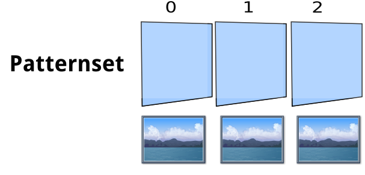

### 3.2 **Estructuras**

En la implementación empleamos diferentes estructuras de datos que permiten y facilitan la carga y
preproceso de patrones el uso sencillo de la red neuronal.  Las estructuras definidas son las
siguentes:

- **Patternset**: Conjunto de patrones y opcionalmente su clasificación, si estos son usados para
  entrenamiento. Los patrones son almacenados como vectores de valores en coma flotante, y la
  salida de la red neuronal será un código, a su vez asociado con el nombre del patrón al que
  pertenece, esto es, del directorio desde donde se leyó. 

  Realiza las operaciones de carga y lectura, de normalización de valores (si es necesario) y de
  guardado de información de entrenamiento que luego no se encuentra disponible durante la
  explotación.

		typedef struct {
			size_t npats, npsets, w, h, bpp, size, ni, no;
			char ** names;     /* Name for each patternset. name[code] */

			double ** input;   /* All input patterns */
			double * input_raw;   /* All input patterns in contiguous memory */
			size_t * codes;    /* Code for each pattern. codes[npat] */
		} patternset_t;

		typedef patternset_t * patternset;
		typedef double * pattern;
  	

- **Perceptron**: Implementación de la red neuronal. En concreto nuestra implementación emplea un
  perceptrón multicapa con una única capa oculta de tamaño variable. Mantiene el estado de las
  capas como una matriz de valores en coma flotante y un cubo de pesos, también en coma flotante.
  Implementa el algoritmo de *Retropropagación*.

		typedef struct {
			int n[3];

			double ** net; /* neuron values */
			double *** w;  /* weights */

			/* Internals */
			double ** d;   /* output delta */
			double ** rw;   /* neuron raw inputs */
			double *** dw;  /* delta weights */

			/* Sizes and pointers to contiguous data
			* in matrices and cubes */
			int net_wize, w_size, d_size, rw_size, dw_size;
			double * net_raw;
			double * w_raw;
			double * dw_raw;

			double(*init)();              /* initialization function */
			double(*trans)(double);       /* transition function */
			double(*trans_prima)(double); /* prima transition function */
			double(*error)(double*,size_t,int); /* error function */
		} perceptron_t;

		typedef perceptron_t * perceptron;

### 3.3 **Proceso**

El programa recibe como entrada una serie de conjuntos de patrones en el entrenamiento o un único
conjunto de patrones (el vídeo a reconocer) durante la explotación. Carga estos patrones como un
único *patternset* y lo pasa a la red neuronal para que opere en consecuencia, bien entrenando o
bien computando la salida de la red.

- **Entrenamiento**: El programa espera una serie de directorios, cada uno conteniendo un conjunto
  de *patrones*. Carga todos los *patrones* encontrados asociándolos al directorio desde el cual
  fueron leídos en un único *patternset*. Este *patternset* es mandado a la red neuronal para que
  se computen las épocas de entrenamiento necesarias para memorizar de forma adecuada los patrones.
  El resultado del entrenamiento es guardado en un fichero de datos externo para su posterior carga
  durante la explotación.

- **Explotación**: El programa espera un único conjunto de *imagenes*/*patrones* y un fichero de
  pesos. Recrea la red a partir de los pesos, inicializa el *patternset* con los *patrones* leídos,
  sin incluir salida conocida, y los pasa por la red neuronal ya entrenada e inicializada de forma
  que se obtenga una salida para cada fotograma. Esta salida puede ser un código conocido para un
  conjunto de patrones incluido en el entrenamiento, o bien una salida desconocida que indicaría
  que el fotograma no ha sido reconocido.

El proceso está pensado de forma que la explotación pueda ser ejecutada múltiples veces de forma
rápida sobre datos distintos, una vez debidamente entrenada la red.

La salida del programa (que no la red) es la clasificación completa para cada fotograma del vídeo.
Mediante el análisis de cada fotograma y conociendo la frecuencia de muestreo del vídeo (*fps*) es
posible conocer en que segundo exacto comenzó la emisión de un vídeo reconocido, y durante cuanto
tiempo, en un análisis de la salida posterior.

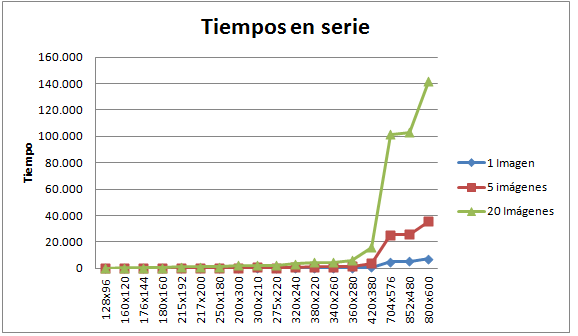

### 3.4 **Adaptación de imágenes**

Desgraciadamente, la aproximación al problema tal y como ha sido descrita es impracticable tal
cual. El volumen de datos a analizar para un vídeo de tamaño pequeño (`640x480` a 25fps) es
sencillamente demasiado alto. El empleo de *patrones* de ese tamaño implicaría una red de,
atención, `307200` neuronas de entrada (`640 * 480` pixeles), que a 16 bytes por pixel nos daría
que el tamaño en memoria de un único patrón es de `4915200` bytes, osea `4Mb`. A `25` frames por
segundo, durante un minuto, tenemos un total de `1500` frames, que hacen que el *patternset* de un
bloque cargado en memoria ocupe: `5Gb` ¡Únicamente en patrones cargados!.  Demasiada memoria a
todas luces para ser almacenada, transmitida y para realizar cálculos pesados en coma flotante
sobre ella.

Fue por tanto necesario la introducción de un proceso de reducción en tamaño de los patrones
cargados, de forma que mantuviesen su esquema de colores y posiciones representativo pero que diese
lugar a un tamaño en memoria manejable y asequible. Para esto, instruimos a la herramienta
`ffmpeg` para reducir las imágenes cargadas mediante un proceso de interpolación a la resolución,
para móviles conocida como `QVGA`, de `120x160` pixeles.

La frecuencia de muestreo del vídeo también debió ser modificada y reducida, empleando 1/2 fotogramas por
segundo, en lugar de los 25 originales del vídeo. Estas medidas de preproceso permiten que la red
pueda ejecutarse de forma efectiva en cualquier máquina con al menos `3Gb` de memoria RAM disponibles
para el usuario, que hoy en día no son raras. 

Estas modificaciones se realizan durante el preproceso de la imagen que realiza el script
`transform.sh` empleando la herramienta `ffmpeg`, con el fin de adaptar los vídeos para su proceso
por parte del programa.

## 4. **Paralelización**

Hablaremos sobre las diferentes maneras de aplicar la paralelización a los algoritmos empleados
durante el proceso de *Entrenamiento* y *Explotación* de la red neuronal.

### 4.1 **Opciones de paralelización**

Al abordar la paralelización del sistema anteriormente descrito, fueron planteadas dos maneras de
obtenerla, bien **dividiendo la entrada** en bloques independientes, cosa posible, al haber
dividido los vídeos en fotogramas independientes, o bien directamente **modificando los
algoritmos**.

- **Dividir la entrada**: Desde el momento en el que tratamos con frames completamente
  independientes unos de otros, es perfectamente posible la división de trabajo entre diferentes
  instancias del programa, que analicen por separado. Esto nos deja diferentes esquemas para el
  entrenamiento y la explotación.

- **Modificación de algoritmos**: El algoritmo de *retropropagación* es fácilmente paralelizable,
  pero con algunos peros, ya que presenta patrones de acceso a memoria muy extensivos, haciendo que
  grandes cantidades de memoria converjan en un único cálculo, haciendo que su separación y
  división entre diferentes unidades de cómputo sea fácil, pero costosa en memoria. 

Las posibles mejoras sobre los algoritmos serán tratadas en al apartado correspondiente a cada
tecnología, ya que durante la aplicación de cada una se ha seguido cada una de las opciones
planteadas inicialmente. En estas secciones hablaremos sobre los diferentes esquemas de
configuración del entrenamiento y de la explotación mediante la división de la entrada.

### 4.2 **Entrenamiento**

Durante el entrenamiento, todos los patrones deben ser presentados ante la red, los pesos son
modificados y vuelta a empezar. A este ciclo de presentar todos los patrones a la red asociado con
sus salidas lo llamamos una *época*. Tras la presentación de cada patrón, la red cambia sus pesos,
calculando las diferencias o *deltas* y aplicándolos sobre el cubo de pesos.

- **División de patrones**: Una posible paralelización sería la división de patrones entre
  diferentes instancias de una red neuronal. Cada red entrenaría de forma independiente,
  presentando menos patrones cada una, y por tanto mejorando el rendimiento general del
  entrenamiento. Esto condicionará después la manera en la que se configurará la fase de
  *explotación*, ya que al conocer cada red un conjunto distinto de patrones, todos deberán
  reconocer el vídeo completo y después poner en común sus hallazgos.

- **Entrenamiento distribuido**: Otra posibilidad (la elegida en `MPI`), es la de enviar conjuntos
  diferentes de patrones de entrenamiento a diferentes instancias de la red, distribuidas y
  concurrentes que entrenen de forma paralela. Sin embargo, tras cada época de entrenamiento, todas
  las redes pondrían en común sus correcciones, es decir, sus *deltas*, calcularían unos nuevos
  *pesos* de forma común y distribuirían estos pesos nuevos, de forma que todas las redes
  estuviesen sincronizadas y comenzasen cada época siendo completamente idénticas. 
  
  Este último método no condiciona la fase de *explotación*, ya que el resultado del entrenamiento
  es un único conjunto de pesos de una red completamente entrenada para todos los patrones de
  entrenamiento presentados. Este método, sin embargo, implica una comunicación constante entre
  las diferentes instancias de la red neuronal, comunicación que puede tener un coste no trivial
  dependiendo de la tecnología empleada para realizar la paralelización.

### 4.3 **Explotación**

La configuración de explotación elegida depende en gran medida de la estrategia de entrenamiento
seguida. Distinguimos dos grandes maneras de configurar la *explotación* mediante división de los
patrones.

- **Muchas redes incompletas**: Si obtenemos un conjunto de redes neuronales entrenadas,
  cada una de las cuales es capaz de reconocer un conjunto diferente de patrones, el modo de
  operación haría pasar el vídeo completo por todas las instancias de la red, y poner en común
  todas las salidas generadas para obtener una única salida común a todas las redes. Este enfoque
  no representa mejora teórica, alguna, ya que la paralelización no disminuye la cantidad de
  cómputo, al tener que procesarse el vídeo entero por cada instancia. Es más, multiplica la
  cantidad de trabajo total a realizar durante la fase de *explotación*, ya que el vídeo será
  analizado por completo `n` veces. Además, incurriríamos en un cuello de botella grande al deber
  transmitir el vídeo por completo a todas las diferentes instancias independientes de la red, lo
  que, siendo el vídeo un conjunto de datos voluminoso, no es trivial. Es una muy mala opción bajo
  cualquier parámetro estudiado.

- **Una única red completa**: Si obtenemos para la fase de *explotación* un conjunto de pesos
  entrenado para conformar una red neuronal capaz de reconocer y clasificar cualquiera de los
  patrones del problema, podríamos replicar esa red en diferentes instancias idénticas, que
  analizasen cada una un subconjunto diferente de todos los *patrones* a reconocer en el bloque de
  vídeo que se encuentra siendo analizado. Esto permitiría el análisis concurrente del vídeo de
  forma sencilla en `n` instancias diferentes de la red, representando una gran mejora al dividir
  el problema completo y disminuyendo la transmisión de datos entre instancias, ya que cada una
  solo recibirá una fracción del problema general. La salida de cada clon de red es sencillamente
  yuxtapuesta por el orden de aparición de los patrones. Esta es la mejor opción y la elegida,
  junto con la configuración de la fase de *entrenamiento* que la hace posible.

### 4.4 **Elección y conclusión**

La elección tomada para la división de los patrones es la que permite el mayor nivel de paralelismo
en la explotación, que es realmente la parte crítica de nuestro sistema, ya que se entrenará una
única vez, pero se realizar la explotación de forma repetida procesando una gran cantidad de
entradas.

En concreto, el esquema de división de patrones será:

- **Entrenamiento**: Muchas instancias de la red, entrenando subconjuntos de patrones y poniendo
  las correcciones de pesos en común tras cada época, de forma que la red sea idéntica en todas las
  instancias tras cada iteración.

- **Explotación**: Muchas instancias de la red entrenada, evaluando subconjuntos de patrones y
  poniendo en común su salida de forma directa.

Esta estrategia permite paralelizar tanto **entrenamiento** como **explotación**.

## 5. **MPI**

La primera versión paralelizada del algoritmo se realizó empleando la tecnología *MPI*, la cual
permite distribuir el cómputo de algunos fragmentos de funciones entre diferentes máquinas físicas
a través de la conexión red. 

Los principales inconvenientes de este tipo de paralelización radican en los cuellos de
botella producidos por la comunicación entre los nodos a través de la red.

### 5.1 **Paralelización**

La paralelización mediante *MPI* se ha realizado de forma que sea posible dividir la entrada a
*entrenar*/*explotar* entre diferentes nodos, trabajando cada uno de la forma más independiente
posible de manera que se reduzca la comunicación por red lo más posible.

En concreto, se modificó el *entrenamiento* para ser realizado de la forma anteriormente descrita,
entrenando una única red en muchos nodos de forma distribuida, manteniéndolos sincronizados, y se
configuró la fase de *explotación* para poder dividir el conjunto de frames del vídeo a procesar
entre diferentes máquinas independientes, cada una con una copia de la red neuronal y que
funcionaban de forma independiente.

### 5.2 **Entrenamiento**

La paralelización del entrenamiento es la parte más compleja para la paralelización del algoritmo.
La operación de la red neuronal necesita del acceso a prácticamente toda la memoria disponible en
la red, de forma que el proceso distribuido de un bucle concreto no era factible debido a la gran
cantidad de memoria que debía ser transmitida por red para realizar cada operación.

Además, durante el entrenamiento de la red, las correcciones de pesos deben tener en cuenta todos
los patrones presentados, y tras cada época deben presentarse todos los patrones, de forma que no
era posible entrenar la misma red con conjuntos de *frames*/*patrones* diferentes y mezclar a
posteriori sus redes. Un procesamiento distribuido que no tuviese en cuenta las correcciones de
pesos para cada *patrón* rompería el principio del algoritmo de *retropropagación*, y haría cada
red independiente derivar hacia una corrección de errores distinta.

Una vez asegurada la necesidad de corregir los pesos con los deltas obtenidos a partir de **todos**
los patrones, tras **cada** época, el entrenamiento se planteó de forma los patrones a entrenar se
repartiesen inicialmente entre todos los nodos disponibles, cada uno con un conjunto diferente, que
entrenasen cada una época, obteniendo un conjunto de *deltas*, los cuales eran puestos en común
para corregir los pesos de la red, y esta, distribuida de nuevo a todos los nodos, para volver a
empezar y calcular una nueva época de forma distribuida.

Los pasos del entrenamiento son:

1. Distribuir los patrones entre los nodos en conjuntos independientes.
1. Inicializar la red neuronal en *master*.
1. Comienza el entrenamiento
1. Copiar los pesos de la red a todos los nodos.
1. Calcular una época en todos los nodos sobre los patrones disponibles.
1. Enviar los deltas calculados a *master*.
1. Calcular nuevos pesos de la red en *master*, aplicando todos los *deltas* recibidos.
1. Vuelta a 4.

De esta manera, la implementación hace uso de las siguientes funciones:

- **broadcast_sizes**: Distribuye desde el nodo principal la configuración de la red.
- **broadcast_weights**: Distribuye desde el nodo principal la red en si, esto es, el cubo de pesos
  que determina su comportamiento.

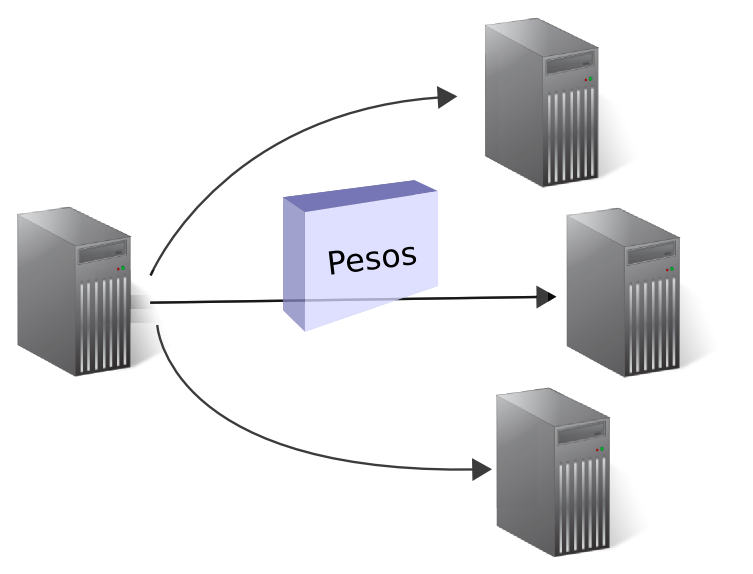

- **distribute_patterns**: Divide el conjunto de patrones disponibles entre los diferentes nodos
  disponibles a partir de la función de MPI `MPI_Scatterv` de forma equitativa entre cada nodo.

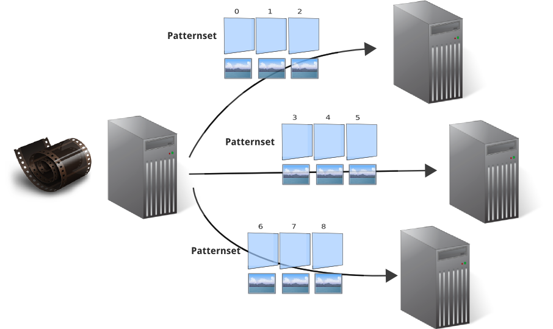

- **compute_new_weights**: Llamado desde el nodo root, calcula los nuevos pesos a partir de los
  deltas ya calculados en cada una de las máquinas de forma independiente mediante la función
  `MPI_Reduce`.

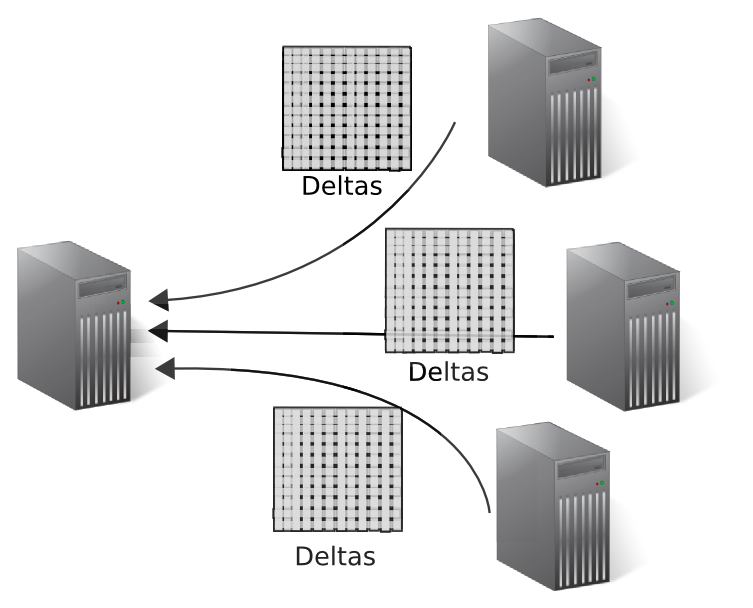
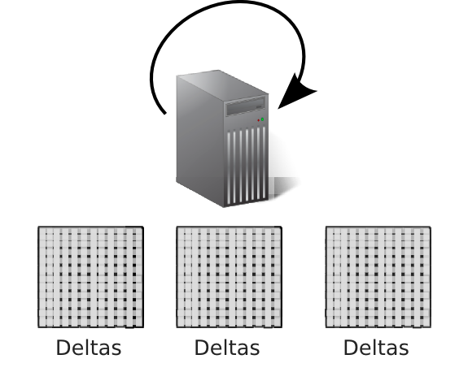

Mediante estas 4 funciones, es posible realizar los pasos anteriormente descritos, esto es,
distribuir los patrones por la red, realizar una época y devolver los deltas para calcular el nuevo
estado de la red neuronal.

### 5.3 **Explotación**

Durante la fase de explotación, los pesos definitivos de la red se encuentran disponibles, y el
producto de esta fase es la categorización de cada fotograma de entrada, es decir, los códigos de
salida.

La paralelización de esta fase consiste en distribuir los pesos de la red y los patrones de entrada
entre los diferentes nodos, calcular los códigos de salida, y recoger todos estos códigos de nuevo
en el nodo principal para analizarlos.

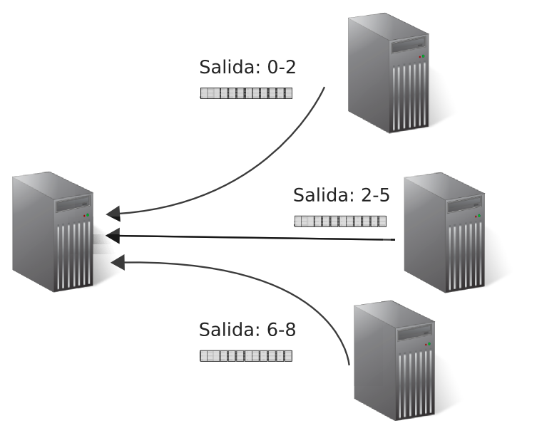

### 5.4 **Implementación**

La implementación de la versión `MPI` fue especialmente trabajosa, ya que incluía el envío por red
de estructuras anidadas tales como matrices de 3 dimensiones no cuadradas, es decir, con longitudes
diferentes para cada fila y columna, y suponía un nuevo esquema completamente nuevo de
entrenamiento.

El principal obstáculo encontrado fue la necesidad de reservar la memoria de forma continua, de
manera que pudiese ser enviada por red fácilmente empleando las funciones de `MPI` sin necesidad de
realizar varios envíos por separados o definir strides variables para cada capa o dimensión. La
implementación secuencial del algoritmo realizaba múltiples llamadas al sistema para reservar
memoria, asignándola directamente a arrays de punteros. Esto cambió, de forma que toda la memoria
de las matrices y cubos necesarios durante el empleo del algoritmo se reservaban mediante una única
llamada al sistema, y se incluía un procedimiento posterior que asignaba a arrays de punteros las
posiciones de memoria donde debían empezar las filas y columnas de las matrices y cubos, de forma
que se pudiese acceder a estas estructuras de la misma manera y no fuese preciso cambiar el resto
del algoritmo.

### 5.5 **Rendimiento**

El speedup es de un 40% aproximadamente, el rendimiento conseguido mediante esta forma de
entrenamiento no mejora tanto como debería el obtenido mediante la versión secuencial en tiempos,
debido principalmente al tiempo empleado en la comunicación por red, que debe establecerse para
cada época o ronda del entrenamiento y debido también a la gran cantidad de datos que deben
enviarse entre todos los nodos, que con imágenes de cierta resolución puede alcanzar fácilmente el
tamaño de varios megabytes, siendo material no demasiado adecuado para ser transmitido por red de
forma iterada y frecuente.

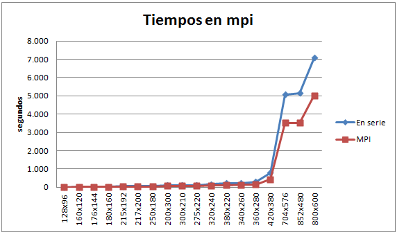
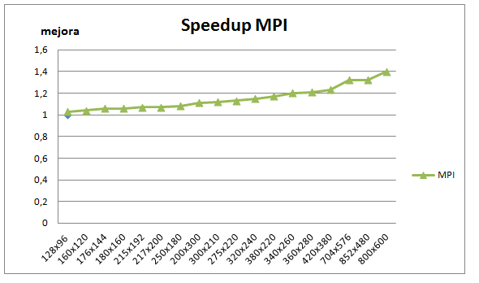

## 6. **OpenMP**

La implementación bajo `OpenMP` sigue un enfoque diferente con respecto al empleado en `MPI`. En
lugar de realizar un paralelismo mediante división de la entrada, se decidió trabajar sobre el
algoritmo en si mismo directamente, trabajando los bucles de proceso de la red neuronal. 

### 6.1 **Paralelización**

La paralelización se ha realizado sobre los bucles que procesan los pesos de la red multiplicando
el valor de la neurona por un peso concreto y obteniendo de esta forma la salida de la red tras
computar una capa tras otra. El proceso de cálculo del valor de una neurona en la capa siguiente es
resultado de la suma pesada de las neuronas de la capa anterior, con respecto a los pesos de las
uniones entre ambas capas. 

El cálculo necesita pues acceder a tres apartados en memoria. Los pesos entre pares de neuronas,
los valores de las neuronas de la capa anterior y escritura de los valores resultantes en la capa
siguiente.

Esta forma de procesamiento permite dividir la operación tomando como unidad de división la neurona
de destino en la capa siguiente. Se necesita leer el valor de la neurona en la capa anterior, y a
los pesos específicos que tienen como destino la neurona en cuestión, escribiendo el resultado en
la misma neurona destino que hemos utilizado para dividir el procesamiento.
De esta manera se puede dividir la tarea en hilos que trabajen de forma concurrente con el menor
acoplamiento posible.

### 6.2 **Entrenamiento**

El entrenamiento se realiza de manera habitual, presentando todos los patrones en la misma máquina
de igual forma que en la versión secuencial, sólo que realizando el proceso de los bucles de
feedforward y de actualización de pesos de forma paralela mediante `OpenMP`.

### 6.2 **Explotación**

La fase de explotación consiste fundamentalmente en la aplicación de `feedforwarding` a todos los
patrones presentados y en recoger su entrada. Habiendo sido la función `feedforward` paralelizada,
la explotación es similar a la empleada en la versión secuencial, donde se presentan todos los
patrones a la red y el resultado es guardado y posteriormente presentado para su interpretación.

### 6.3 **Implementación**

Siguiendo la manera anteriormente comentada, en la sección **Paralelismo**, se necesita acceso de
lectura compartido a toda la capa anterior para cada cálculo, pero sin embargo las lecturas de los
pesos pueden ser separadas, ya que solo se accederá a esas posiciones de memoria desde esa división
de paralelismo, y la escritura también es privada, ya que no existe otra tarea concurrente que
necesite acceder a esa zona de memoria.

En definitiva, se separa el cálculo del feedforward de la red en varios hilos, cada uno de los
cuales calcula la salida de un conjunto de neuronas, para lo cual necesita consultar los valores de
todas las neuronas de la capa anterior (disponible memoria compartida o `shared`), los pesos
específicos con destino a esa neurona (separable y privado) y la capa de destino, de forma privada
ya que se encuentra dividida por hilo.

### 6.4 **Rendimiento**

La paralelización adolece de la necesidad del acceso concurrente a cierta sección de memoria, la de
la capa posterior, para escritura de forma constante, por lo tanto los threads deben sincronizarse
cada pocas operaciones, bloqueando la libre ejecución de los mismos, y perjudicando por tanto el
buen funcionamiento del algoritmo, obteniendo únicamente una pequeña mejora sobre el resultado
teórico.

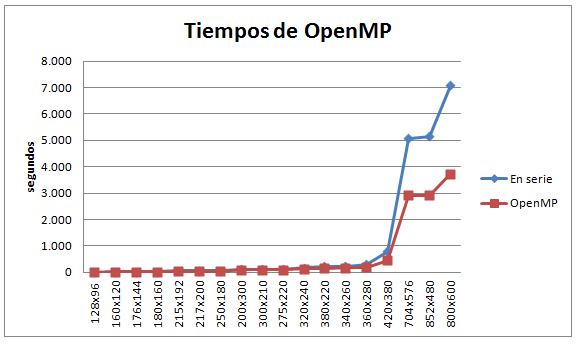
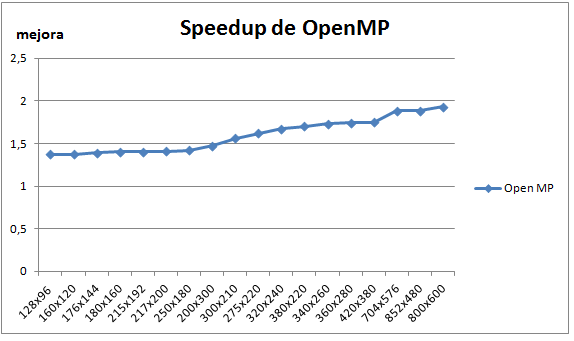

## 7. **CUDA**

La implementación en `CUDA` hace uso de procesadores vectoriales paralelos para la optimización de
ciertos cálculos. El paralelismo ha de realizarse por tanto dividiendo el problema en múltiples
hilos que se procesarán de forma concurrente, con el inconveniente de estar estos procesadores que
gestionan los hilos, separados en grids y bloques, lo cual limita el acceso a la memoria.

### 7.1 **Paralelización**

La paralelización seguida requiere un particionamiento similar a la de `OpenMP`. En al adaptar el
programa para`CUDA`, hemos de mejorar el proceso de cálculo de `feedforward y modificar el código
del algoritmo, de forma que este se procese en paralelo.

La división de paralelismo es la misma que la empleada en el punto anterior, es decir, se separa de
forma que cada hilo debe calcular una/s neuronas en la capa siguiente, en base a leer los valores
de las neuronas pertenecientes a la capa anterior. Para esto es necesario tener disponible la capa
anterior para lectura en cada uno de los bloques de hilos como solo lectura. Los pesos si pueden
ser repartidos por bloque, ya que cada peso es accedido por un solo hilo.

Para cada neurona en la capa siguiente, cada hilo procesa todas las neuronas de la capa anterior
(disponibles en memoria compartida de solo lectura) multiplicadas por su propio coeficiente, por su
peso, y escrita en la neurona destino. De esta forma se aplica división sobre la memoria de
escritura, ya que cada hilo, cada core, será el único que escriba sobre la capa destino.

### 7.2 **Explotación**

En la explotación se ha paralelizado la funcionalidad de `feedforward` de forma que se ejecute de
forma paralela. Se define la función de kernel de forma que calcule el `raw input` para cada
neurona de la capa siguiente, dividiendo sobre la escritura, asignando a cada hilo un conjunto
fijo de valores que debe calcular y escribir, esto es, asignando a cada hilo un espacio en memoria
para el que calculará varios valores y que escribirá.

El algoritmo de entrenamiento paraleliza el cálculo de la función sigmoide bipolar sobre un vector
de neuronas ya sumadas pero no procesadas por la función de activación (raw input), de forma que se
calcula de forma paralela el raw input de una neurona de la capa siguiente y se le aplica la
sigmoide bipolar a los valores por separado. Al encontrarse ya los valores pasados al dispositivo
debido a la llamada anterior, no es necesario volverlos a enviar.

### 7.3 **Entrenamiento**

La sección paralelizada en `CUDA` ha sido la de `feedforward`, ya que es la que más tiempo consume
con diferencia. El resto, actualizaciones de pesos etc... son sumas relativamente rápidas que se
decidió no paralelizar, ya que se estimó que el esfuerzo de envío de los datos necesarios de los
deltas calculados a la memoria del dispositivo sería mayor que la ganancia por calcular estos de
forma paralela.

### 7.4 **Implementación**

Los problemas encontrados durante la implementación de la versión `CUDA` se debe a las grandes
cantidades de memoria directamente relacionada que debe procesarse. En otras palabras, los
problemas son debidos a los accesos durante el cálculo a *todas* las neuronas de la capa anterior,
y a *todos* los pesos para esa neurona. Eso es mucha memoria, tanta que hemos encontrado problemas
a partir de resoluciones de más de `160x120`, ya que al parecer no es posible distribuir tanta
memoria entre bloques.

No es posible definir los pesos como memoria privada para un bloque ya que se trata de demasiada
memoria, y no hay espacio suficiente para ello, tampoco puede replicarse la capa anterior de la red
neuronal en cada bloque por ser demasiado grande. De todas maneras, incluso si cupiese la capa
anterior de la red en un bloque, no cabría desde luego, además, los pesos.

En estas circunstancias, la decisión fue incluir la memoria de solo lectura de la capa anterior de
la red neuronal y de los pesos en una memoria de tipo `textura`. Esta memoria, según la
documentación, mantiene un tiempo de acceso razonable, un gran tamaño, y está disponible a la vez
para todos los núcleos, de forma que al no necesitar replicación, se evita tener que moverla
repetidamente al dispositivo, acortando el tiempo de transferencia, que es el cuello de botella del
sistema conjunto.

La memoria que se va a escribir, es decir, la capa siguiente, cuyas neuronas se están calculando en
la etapa de `feedforward`, se sitúa como memoria de bloque, privada, ya que se encuentra dividida
por hilo y no se realizan accesos desde otros hilos.

### 7.5 **Rendimiento**

El hecho de calcular una función con varios coeficientes, los cuales son leídos desde memoria no
cacheada y fuera del bloque del dispositivo `CUDA`, unido al tiempo necesario para trasladar estas
grandes cantidades de memoria a la tarjeta gráfica, hace que el cálculo no sea todo lo eficiente
que teóricamente se esperaba, mostrando un desempeño aproximadamente similar a las otras versiones
y mpi y openmp. Adicionalmente, existen problemas con el proceso de redes de tamaño elevado, debido
al límite de memoria específica presente en estas tarjetas.

El procesamiento de redes neuronales es especialmente apto para ser adaptado en este tipo de
procesadores y el rendimiento, aunque ronde el 80% de mejora, no es el esperado.

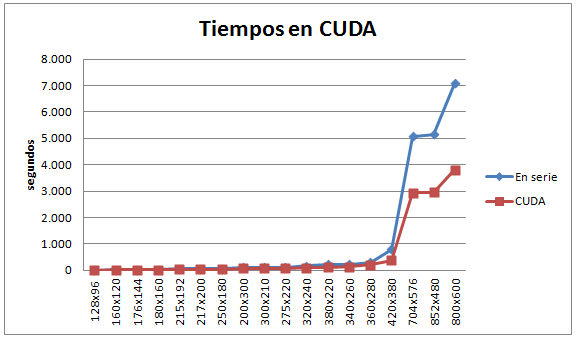
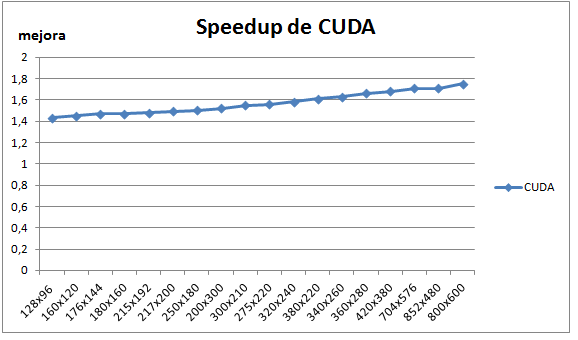

## Apéndice: Código específico

En esta sección se listará el código específico empleado para cada versión del programa mediante
cada tecnología. La versión MPI además necesitó de la reestructuración del programa casi al
completo debido al tipo de reserva de memoria necesaria, que debiese alinear de forma contínua toda
la memoria reservada para ser posible su envío y recepción de forma sencilla mediante comunicación
por red.

### Caveboy MPI

**broadcast_sizes**: Distribuye entre los nodos la configuración inicial de la red.

	/* Share perceptron parameters */
	int broadcast_sizes(int * nin, int * nh, int * nout, int * npats, int rank) {
		int vals[4];

		if( rank == 0 ){
			vals[0] = *nin;
			vals[1] = *nh;
			vals[2] = *nout;
			vals[3] = *npats;
		}

		MPI_Bcast(vals, 4, MPI_INT, 0, MPI_COMM_WORLD);

		if( rank != 0 ) {
			/* Receive and set perceptron sizes */
			*nin  = vals[0];
			*nh   = vals[1];
			*nout = vals[2];
			*npats = vals[3];
		}

		return TRUE;
	}

**broadcast_weights**: Distribuye entre los nodos los pesos de la red neuronal.

	/* Set weights from master to all other nodes */
	int broadcast_weights(perceptron per){

		MPI_Bcast(&(per->w[0][0][0]), per->w_size, MPI_DOUBLE, 0, MPI_COMM_WORLD);

		set_cube_pointers(per->w, &(per->w[0][0][0]), per->n);

		return TRUE;
	}

**compute_new_weights**: Recalcula los pesos a partir de los diferentes deltas calculados de forma
distribuida.

	/* Gets deltas from all processors and computes new weights */
	int compute_new_weights(perceptron per, int rank){

		MPI_Reduce( MPI_IN_PLACE,              /* Use current root deltas */
						&(per->dw[0][0][0]),   /* Current deltas */
						per->w_size,            /* weights cube sizes */
						MPI_DOUBLE,
						MPI_SUM,
						0,
						MPI_COMM_WORLD);

		/* Sum weights on root */
		if( rank == 0 ){
			size_t n = per->w_size;
			double * w = &(per->w[0][0][0]);
			double * dw = &(per->dw[0][0][0]);

			while( n-- )
				*(w + n) += *(dw + n);
		}

		/* Fix w and dw pointers */
		set_cube_pointers(per->w, &(per->w[0][0][0]), per->n);
		set_cube_pointers(per->dw, &(per->dw[0][0][0]), per->n);

		return TRUE;
	}

**return_codes**: Recolecta los resultados obtenidos tras ejecutar la red de forma distribuida en
modo de explotación.

	* Get the result codes from all processors */
	int return_codes(int * codes, int n, int * allcodes, int nall){

		MPI_Gather(codes, n, MPI_DOUBLE, allcodes, nall, MPI_DOUBLE, 0, MPI_COMM_WORLD);

		return TRUE;
	}

**distribute_patterns**: Divide el conjunto de patrones sobre los que se realiza el
entrenamiento/explotación entre todos los nodos disponibles de forma equitativa.

	/* Splits patterns within all available nodes.
	* Creates a new patternset to store the patterns.
	*
	* @param pset Original patternset with right sizes. (And data if root)
	* @param newpset Uninitialized patternset by reference.
	* @param rank Processor rank.
	* @param size Comm size. */
	int distribute_patterns(patternset pset, patternset * newpset_ptr, int rank, int size) {

		/* Each process receives an equal slice of patterns.
		* Root gets the slice plus the spare patterns. */
		int i = 0;
		int patsize  = pset->ni + 1;
		int partsize = pset->npats / size;
		int rootsize = partsize + (pset->npats % size);
		int partsize_units = partsize * patsize;
		int rootsize_units = rootsize * patsize;

		/* How many doubles are to be read */
		/* How far away is the next value */
		int * scounts = (int *) malloc (size * sizeof(int));
		int * strides = (int *) malloc (size * sizeof(int));
		patternset newpset = NULL;

		/* Create new patternset */
		patternset_create(&newpset,
				rank == 0 ? rootsize : partsize,
				patsize,
				pset->npsets);
		patternset_init(newpset);

		*newpset_ptr = newpset;

		/* Set how many doubles are to be sent/received */
		scounts[0] = rootsize_units;
		strides[0] = 0;

		for(i = 1; i < size; ++i) {
			scounts[i] = partsize_units;
			strides[i] = rootsize_units + (i-1) * partsize_units;
		}

		/* Send patterns to each new perceptron on net */
		MPI_Scatterv(pset->input_raw, scounts, strides, MPI_DOUBLE,
				newpset->input_raw, scounts[rank], MPI_DOUBLE, 0, MPI_COMM_WORLD);

		/* Adapt memory pointers on new perceptrons */
		for(i = 0; i < scounts[rank]; ++i)
			newpset->input[i] = &(newpset->input_raw[i * scounts[rank] ]);

		return TRUE;
	}

**distribute_codes**: Distribuye los códigos asociados a cada patrón de entrada entre los nodos de
la red de forma que pueda compararse la entrada con la salida durante el entrenamiento.

	/* Distributes codes within all processors.
	* Follows the same scheme as distribute_patterns.
	* To be used after distribute_patterns.
	* newpset is supposed to be already initialized.
	*
	* @param pset Original initialized pset with right sizes (Data only on root).
	* @param newpset Initialized patternset with distribute_patterns.
	* @param rank Processor rank.
	* @param size Comm size  */
	int distribute_codes(patternset pset, patternset newpset, int rank, int size) {
		/* Each process receives an equal slice of codes.
		* Root gets the slice plus the spare codes. */
		int partsize = pset->npats / size;
		int rootsize = partsize + (pset->npats % size);
		int i = 0;

		/* How many doubles are to be read */
		/* How far away is the next value */
		int * scounts = (int *) malloc (size * sizeof(int));
		int * strides = (int *) malloc (size * sizeof(int));

		/* Set how many doubles are to be sent/received */
		scounts[0] = rootsize;
		strides[0] = 0;

		for(i = 1; i < size; ++i) {
			scounts[i] = partsize;
			strides[i] = rootsize + (i-1) * partsize;
		}

		/* Send patterns to each new perceptron on net */
		MPI_Scatterv(pset->codes, scounts, strides, MPI_UNSIGNED_LONG,
				newpset->codes, scounts[rank], MPI_UNSIGNED_LONG, 0, MPI_COMM_WORLD);

		return TRUE;
	}

**training**: Versión paralelizada del algoritmo de entrenamiento, que realiza el entrenamiento de
forma distribuida mediante el uso de las funciones anteriores.

	/* Train the network in a parallelized manner
	*
	* All available patterns are split in different subsets and delivered within nodes.
	* Each nodes computes only a subset of patterns and calculates deltas for those.
	* Deltas are sent back to master and joined with current weights.
	* New wegiths are sent to all nodes and a new epoch begins.
	*
	* 1. Distribute patterns and codes to each node.
	* 2. For each epoch:
	* 		1. Master broadcasts current neuron weights within nodes.
	* 		2. All nodes compute next epoch for given patterns.
	* 		3. All nodes returns computed deltas to master.
	* 		4. Master applies deltas to current weights.
	* 		5. [Future] Master calibrates workload per node
	* 		      and adjusts pattern distribution.
	*/
	int training(perceptron per, patternset pset, int max_epoch, double alpha,
			char * weights_path, int rank, int size;
			char * tinfo_path, char * error_path){
		FILE * error_file = NULL;

		/* Save obtained training info. Basically, patternsets names */
		if( rank == 0 )
			patternset_print_traininginfo(pset, tinfo_path);

		for(epoch = 0; epoch < max_epoch; ++epoch) {

			/* Send root weights in each processor */
			broadcast_weights(pset);

			/* Compute backpropagation for each available pattern.
			* Do not update weights, get only deltas in per->dw */
			for(pat = 0; pat < pset->npats; ++pat)
				perceptron_backpropagation_raw(per, pset->input[pat], pset->codes[pat], alpha, 0);

			/* Get deltas back from each processor and compute new weights */
			compute_new_weights(per, rank) */

			/* TODO: get performance stats and adjust pattern distribution */
		}

		/* Master saves current weights  */
		if( rank == 0 )
			perceptron_printpath(per, weights_path);

		return TRUE;
	}

**testing**: Implementación paralelizada de la fase de explotación mediante las funciones
anteriores.

	/* Exploiting network in a parallelized manner.
	*
	* The testing phase uses an already trained net
	* to classificate new unknown presented datterns.
	*
	* 1. Distribute patterns withing nodes.
	* 2. Pass all nodes through the net in each node and save the output.
	* 3. Return obtained codes for each node.
	* 4. Join all codes into a single result.
	*/
	int testing(perceptron per, patternset pset, int npatsall, double radio, char * weights_path, char * tinfo_path) {
		size_t pat = 0, n = 0, matches = 0;
		int chosen = 0;
		int * codes = NULL;
		int * allcodes = NULL;
		double min = 1.0 - radio;

		/* Testing phase uses an already trained net to try to clasificate
		* new unknown patterns.
		*
		* 1. Recuperate patterns code-name associations from training.
		* 2. Recuperate trained perceptron weights.
		* 3. Pass each pattern through the net and save the output.
		* 4. Calculate stats.
		*/

		if( rank == 0 ){
			/* Recuperate training patterns info. */
			if( patternset_read_traininginfo(pset, tinfo_path) == FALSE)
				return FALSE;

			/* Recuperate trained net. Read weights. */
			if( perceptron_readpath(&per, weights_path) == FALSE )
				return FALSE;
		}

		/* Distribute patterns within nodes for testing
		* We get a prepared pset with this
		* distribute_patterns_testing() */

		/* Broadcast trained net weights from master
		* broadcast_weights */

		if( pset->npats <= 0 )
			return FALSE;

		codes = (int *) malloc (sizeof(int) * pset->npats);

		/* Alloc extra codes for root, which has to deal with the result */
		if( rank == 0 )
			allcodes = (int *) malloc (npatsall * sizeof(int));

		/* Use trained net per each input pattern
		* and put the output in a vector */
		for(pat = 0; pat < pset->npats; ++pat){
			perceptron_feedforward(per, pset->input[pat]);

			/* Find the most excited neuron
			*
			* Undecidible (not found, -1) if:
			* - Most excited neuron doesn't get close enough (> min)
			* - More than 1 neuron has been activated (matches > 1).
			*/
			matches = 0;
			chosen = -1;
			for(n = 0; n < pset->no; ++n){
				if( per->net[2][n] > min ) {
					chosen = n;
					++matches;

					/* 1 active neuron at most */
					if( matches > 1 ) {
						chosen = -1;
						break;
					}
				}
			}

			codes[pat] = chosen;
		}

		/* Send all codes and then join them */
		return_codes(codes, pset->npats, allcodes, npatsall);

		/* Print results */
		if( rank == 0 ){
			for(pat = 0; pat < npatsall; ++pat) {
				printf("Output for %i: %i\n", pat, allcodes[pat]);
			}
		}

		if( codes != NULL )
			free(codes);

		if( allcodes != NULL )
			free(allcodes);

		return TRUE;
	}

### Caveboy OpenMP

**Feedforward**: Paralelización del bucle de feedforward

	/* Open MP */
	#pragma omp parallel for default(none) private(i, j, k, sum, n) shared(per->net)

		/* For the input and hidden layers */
		for(i = 0; i < 2; ++i)
			/* For all neurons in layer (+ bias) */
			for(j = 0; j < per->n[i] + 1; ++j)
				/* For all neurons in next layer (no bias) */
				for(k = 0; k < per->n[i+1]; ++k) {
					/* Sum all neurons (j=n[i]) in layer by its
					* weight w[j][k] to a certain neuron (k) */

					/* sum = perceptron_weighted_sum(per->net[i], per->w[i], k, per->n[i] + 1); */
					sum = 0;
					n = per->n[i] + 1;
					while( n-- )
						sum += per->net[i][n] * per->w[i][n][k];

					per->net[i+1][k] = perceptron_bipolarsigmoid(sum);
				}

**Backpropagation**: Paralelización de las etapas de backpropagation.

	/* Start Open MP */
	#pragma omp parallel for default(none) private(j,k,rin,per->net,code,lrate) shared(d,dw)

		/* Calculate output layer (i = 2) backpropagation */
		for(k = 0; k < per->n[2]; ++k){
			/* Get the already computed Yk in */
			/* Yk_in = perceptron_weighted_sum(per->net[1], per->w[1], k, per->n[1] + 1); */
			/* Yk_in = rin[1][k]; */

			/* Calculate dk against desired output (neuron k should match the code) */
			d[1][k] = (ISACTIVE(k, code) - per->net[2][k]) * perceptron_bipolarsigmoid_prima(rin[1][k]);

			/* Calculate weight deltas for all weights to this neuron from the previous layer */
			for(j = 0; j < per->n[1] + 1; ++j)
				dw[1][j][k] = lrate * d[1][k] * per->net[1][j];
		}

		/* Calculate hidden layer (i = 1) backpropagation */
	/* Start Open MP */
	#pragma omp parallel for default(none) private(i,j,k,Dj_in,Dj,lrate,per->w,rin,d) shared(dw)
		/* Calculate hidden layer (i = 1) backpropagation */
		for(j = 0; j < per->n[1]; ++j){
			/* Get the already computed Zj_in */
			/* Zj_in = perceptron_weighted_sum(per->net[0], per->w[0], j, per->n[0] + 1); */
			/* Zj_in = rin[0][j]; */

			/* Calculate Dj_in based on output layer deltas and the hidden layer weights */
			Dj_in = 0;
			for(k = 0; k < per->n[2]; ++k)
				Dj_in += d[1][k] * per->w[1][j][k];

			/* Calculate delta */
			Dj = Dj_in * perceptron_bipolarsigmoid_prima(rin[0][j]);

			/* Calculate weight deltas for all weights to this neuron from the previous layer */
			for(i = 0; i < per->n[0] + 1; ++i)
				dw[0][i][j] = lrate * Dj * per->net[0][i];
		}

**Actualización de pesos**: Paralelización de la actualización de pesos de backpropagation.

		if( update ){

			/* Update weights */
			/* For the weighted layers */
	/* Start Open MP */
	#pragma omp parallel for default(none) private(i,j,k,dw) shared(per->w)
			for(i = 0; i < 2; ++i)
				/* For each neuron (+ bias) */
				for(j = 0; j < per->n[i] + 1; ++j)
					/* To all neurons in the next layer */
					for(k = 0; k < per->n[i + 1]; ++k)
						per->w[i][j][k] += dw[i][j][k];
		}

### Caveboy CUDA

**feedforward_layer_kernel**: Cálculo de la entrada no procesada de una neurona cualquiera de la capa siguiente.

	__global__ void feedforward_layer_kernel(float * resultlayer, int width, int neurons, int threadSize, int totalSize){
		int idx = blockIdx.x * blockDim.x + threadIdx.x + threadSize;
		int max = idx + threadSize;
		int i = 0, n = neurons;

		if( max > totalSize )
			max = totalSize;

		for(i = idx; i < max; ++i) {
			while( n-- )
				sum += tex1Dfetch(tex_net_layer, n) * (*(tex1Dfetch(tex_weights, (width * n) + i)));

			resultlayer[i] = sum;
		}
	}

**bipolarsigmoid_kernel**: Cálculo de la función de sigmoide bipolar sobre el `raw input` de una
neurona.

	__global__ void bipolarsigmoid_kernel(float * v, int threadSize, int totalSize){
		int idx = blockIdx.x * blockDim.x + threadIdx.x + threadSize;
		int max = idx + threadSize;

		if( max > totalSize )
			max = totalSize;

		for(; idx < max; ++idx)
			v[idx] = 2.0/(1 + exp(-v[idx])) - 1;
	}

**backpropagation cuda**: Adaptación del algoritmo de backpropagation para emplear las funciones de
kernel definidas para trabajar con los procesadores vectoriales `CUDA`.

	/**
	* Computes backpropagation for a perceptron and a given pattern.
	* Raw version which perform the calculations and
	*
	* @param per Initialized perceptron
	* @param pat Initialized pattern
	* @param code Active neuron in output pattern
	* @param lrate Learning rate
	* @return 0 if unsuccessful, 1 otherwise
	*/
	int perceptron_backpropagation_raw_cuda(perceptron per, pattern pat, size_t code,
			double lrate){
		int n = 0, i = 0, j = 0, k = 0, err = 1;
		double Dj_in, Dj, sum;

		/* Rename temp delta vectors */
		double ** d = per->d,     /* Deltas */
			** rin = per->rw, /* Raw neuron inputs */
			*** dw = per->dw;  /* Weight Deltas */

		/* Set input layer values
		* We just make net[0] to point to the pattern so we don't have to copy all
		* of it each time. */
		per->net[0] = pat;

		/* Compute feed forward */

		/* For the input and hidden layers */
		for(i = 0; i < 2; ++i) {

			/* Sum all neurons (j=n[i]) in layer by its
			* weight w[j][k] to a certain neuron (k) */
			float * net = NULL, * weights = NULL; 

			int ndevices = 0;
			/* Calculate how many neurons will calculate each thread */
			int threadSize = 512; /* Neurons to calculate by each processor */ 
			int nThreads = 256;  /* Full ocupation */
			int nBlocks = (per->n[i + 1] / threadSize) / nThreads;  /* n total Blocks */

			cudaGetDeviceCount(&ndevices);

			nBlocks /= ndevices; /* Blocks per grid */

			cudaMalloc((void **) &rawnet, per->n[i + 1] * sizeof(float));
			cudaMalloc((void **) &net, (per->n[i] + 1) * sizeof(float));
			cudaMalloc((void **) &weights , (per->n[i] + 1) * (per->n[i+1]) * sizeof(float));

			/* Set result to 0, and copy net and weights */
			cudaMemset(rawnet, 0, per->n[i + 1] * sizeof(float), cudaMemcpyHostToDevice);
			cudaMemcpy(net, per->net[i], (per->n[i] + 1) * sizeof(float), cudaMemcpyHostToDevice);
			cudaMemcpy(weights, per->w[i], (per->n[i] + 1) * (per->n[i+1]) * sizeof(float), cudaMemcpyHostToDevice);

			/* Set read-only memory to textures */
			cudaBindTexture(0, &tex_net_layer, net, (per->n[i] + 1));
			cudaBindTexture(0, &tex_weights, weights, (per->n[i] + 1) * (per->n[i+1])); 

			feedforward_layer_kernel(rawnet, per->n[i] + 1, per->n[i+1], threadSize, per->n[i] + 1);

			/* Bring raw results from device */
			cudaMemcpy(rin[i], rawnet, per->n[i + 1] * sizeof(float), cudaMemcpyDeviceToHost);

			/* Compute  bipolarsigmoid over the already computed raw results */
			bipolarsigmoid_kernel(rawnet, threadSize, per->n[i] + 1);

			/* Bring computed results from device */
			cudaMemcpy(per->net[i + 1], rawnet, per->n[i + 1] * sizeof(float), cudaMemcpyDeviceToHost);

			cudaUnbind(tex_net_layer);
			cudaUnbind(tex_weights);

			cudaFree(rawnet);
			cudaFree(net);
			cudaFree(weights);
		}

		/* Calculate output layer (i = 2) backpropagation */
		for(k = 0; k < per->n[2]; ++k){
			/* Get the already computed Yk in */
			/* Yk_in = perceptron_weighted_sum(per->net[1], per->w[1], k, per->n[1] + 1); */
			/* Yk_in = rin[1][k]; */

			/* Calculate dk against desired output (neuron k should match the code) */
			d[1][k] = (ISACTIVE(k, code) - per->net[2][k]) * perceptron_bipolarsigmoid_prima(rin[1][k]);

			/* Calculate weight deltas for all weights to this neuron from the previous layer */
			for(j = 0; j < per->n[1] + 1; ++j)
				dw[1][j][k] = lrate * d[1][k] * per->net[1][j];
		}

		/* Calculate hidden layer (i = 1) backpropagation */
		for(j = 0; j < per->n[1]; ++j){
			/* Get the already computed Zj_in */
			/* Zj_in = perceptron_weighted_sum(per->net[0], per->w[0], j, per->n[0] + 1); */
			/* Zj_in = rin[0][j]; */

			/* Calculate Dj_in based on output layer deltas and the hidden layer weights */
			Dj_in = 0;
			for(k = 0; k < per->n[2]; ++k)
				Dj_in += d[1][k] * per->w[1][j][k];

			/* Calculate delta */
			Dj = Dj_in * perceptron_bipolarsigmoid_prima(rin[0][j]);

			/* Calculate weight deltas for all weights to this neuron from the previous layer */
			for(i = 0; i < per->n[0] + 1; ++i)
				dw[0][i][j] = lrate * Dj * per->net[0][i];
		}

		/* Update weights */
		for(i = 0; i < per->w_size; ++i)
			per->w_raw[i] += per->dw_raw[i];

		/* For the weighted layers
		for(i = 0; i < 2; ++i)
			* For each neuron (+ bias) *
			for(j = 0; j < per->n[i] + 1; ++j)
				* To all neurons in the next layer *
				for(k = 0; k < per->n[i + 1]; ++k)
					per->w[i][j][k] += dw[i][j][k]; */

		return err;
	}
